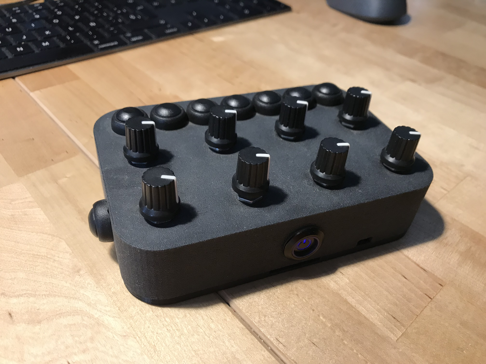
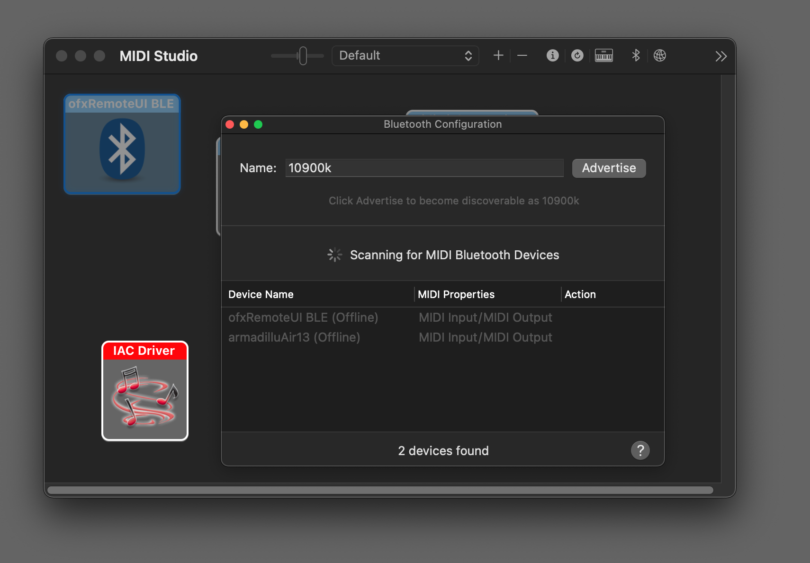

## ofxRemoteUI Wireless Controller

This is an Adafruit feather driven remote wirelss controller for [ofxRemoteUI](https://github.com/armadillu/ofxRemoteUI). It is used to adjust parameters wirelessly. It communicate with midi over bluetooth with an OSX computer. Just turn on the device, make sure bluetooth is enabled on your mac, and launch `Audio Midi Setup.app`. Open up "bluetooth configuration" and connect to the `ofxRemoteUI BLE` device. This creates a midi connection between the controller and your mac, which in turn should be running the ofxRemoteUI OSX client. Then just bind your parameters to the desired control (button or knob) and you are done!

